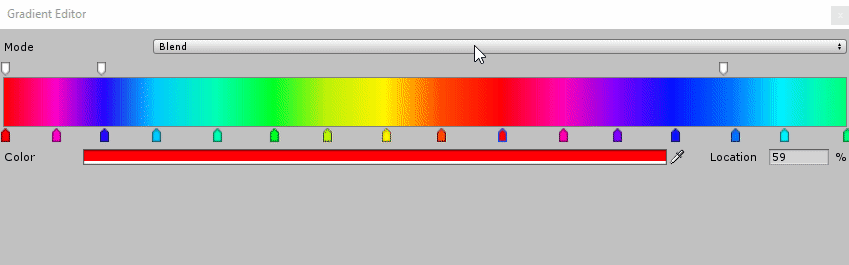
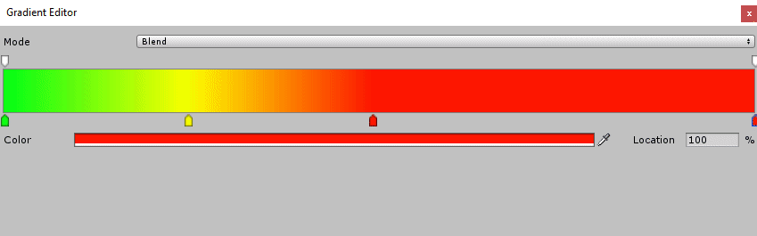
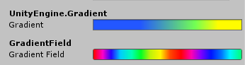

### Expanded Gradient Field 

This project is a case study  trying to Replicate the default Gradient Inspector from Unity3D, but changing few aspects:

- Removing the limit of 8 color/alpha keys:

- Adding the possibility to sample the color/alpha value over the gradient as seen in Adobe Photoshop:

- Adding optional [GradientRepeatMode](Scripts/GradientRepeatMode.cs) field to Evaluate method:
	- **Clamp**: Default gradient Behaviour
	- **PingPong**: Pingpongs the time value from 0 to 1
	- **Repeat**: Repeats the value between 0 and 1

### Usage

The usage is the same from UnityEngine.Gradient. with the same methods and parameters. Just declare the property as GradientField instead of Gradient:
```csharp
	[Header("UnityEngine.Gradient")]
	public Gradient gradient;

	[Header("GradientField")]
	public GradientField gradientField;
	
	void Start()
    {
		//Works!
		gradientField.colorKeys = gradient.colorKeys;
		gradientField.alphaKeys = gradient.alphaKeys;
    }

    void Update()
    {
		//Also works!
		Color result = gradientField.Evaluate(Time.time);

		Color otherResult = gradientField.Evaluate(Time.time, GradientRepeatMode.PingPong);
	}
```
Inspector:


#### About Performance
This solution is built trying to replicate the Unity Behaviour but performance was not taken in consideration. If you are trying to use **A LOT** color/alpha keys, consideer implementing a better search algorythim.